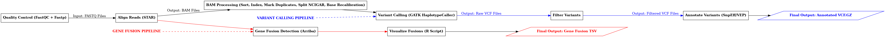

# **RNA-Seq Variant Calling & Fusion Detection Pipeline**  

**A scalable, reproducible, and modular Nextflow pipeline for RNA-seq variant calling and fusion detection.**  

**GitHub Repository:** [Variantcalling-and-Genefusion](https://github.com/kothaiRaja/Variantcalling-and-Genefusion.git) 
 
## RNA-seq Variant Calling and Gene Fusion Workflow

This flowchart represents the RNA-seq analysis workflow, including variant calling and gene fusion detection.





---

## **Overview**  

This pipeline processes RNA-seq data to:  
**Identify genetic variants (SNPs & Indels)** from transcriptomic data.  
**Detect RNA fusion events** critical in cancer research.  
**Perform quality control, alignment, annotation, and reporting** in an automated workflow.  

**Built With:**  
- **Nextflow DSL2** for modularity & scalability.  
- **Singularity** for containerized execution.  
- **FastQC, STAR, GATK, SnpEff, VEP, Arriba** for high-accuracy analysis.  

**Key Features:**  
**Preprocessing**: FASTQ quality control and trimming (FastQC, Fastp).  
**Variant Calling**: STAR alignment, GATK HaplotypeCaller, and variant annotation.  
**Fusion Detection**: STAR + Arriba for RNA fusion detection.  
**MultiQC Reports**: Aggregated QC statistics for easy review.  
**Automated Reference Preparation**: Downloads and indexes necessary reference files.  

---

## **Workflow Overview**  

### **1️⃣ Preprocessing**  
FASTQ **concatenation, quality control (FastQC), and trimming (Fastp)**.  
Generates **MultiQC reports** for aggregated quality analysis.  

### **2️⃣ Variant Calling**  
**STAR alignment** → **BAM processing (sorting, marking duplicates)**.  
**GATK HaplotypeCaller** for SNP & Indel detection.  
**Variant annotation** using **SnpEff & VEP**.  
Outputs **annotated VCF files and structured CSV reports**.  

### **3️⃣ RNA Fusion Detection**  
**STAR fusion mode** aligns reads for fusion detection.  
**Arriba** identifies gene fusions and generates **visualization reports**.  

### **4️⃣ Automated Reference Setup**  
Downloads and processes **reference genomes, annotation files, and known variant databases, respected Tools**. 

### ** Easy User defined Parameters**
Users are able to easily define the path to the reference files(if available). 
Even if the reference files are unavailable, the pipeline fetched all the reference files by executing the processes. 
Running the build_reference_main.nf pipeline, the paths to all the required reference files are written to config file which is used for main.nl pipeline execution.  

---

# **Installation & Setup**  

## **1️⃣ Install Nextflow & Dependencies**  
```bash
curl -s https://get.nextflow.io | bash
chmod +x nextflow
mv nextflow /usr/local/bin/
```
Ensure **Singularity** is installed for containerized execution.  

## **2️⃣ Clone the Repository**  
```bash
git clone https://github.com/kothaiRaja/Variantcalling-and-Genefusion.git
cd Variantcalling-and-Genefusion
```

---

# **How to Run the Pipeline**  

## **Step 1️⃣: Test Pipeline with Default Datasets**  

Before running the pipeline on actual data, test it with the provided test dataset to ensure proper setup.  

### **A. Prepare References (for Test Data)**  
```bash
nextflow run main.nf -c nextflow_ref_test.config --build_references_test -profile singularity
```

### **B. Run the Test Pipeline**  
```bash
nextflow run main.nf -c nextflow_main_test.config -profile singularity
```
**If the test run is successful**, proceed to the main pipeline.  

---

## **Step 2️⃣: Run the Pipeline with Actual Data**  

Once validated, run the pipeline on actual datasets.  

### **A. Prepare References (for Actual Data)**  
```bash
nextflow run main.nf -c nextflow_ref_main.config --build_references -profile singularity

```

### **B. Run the Full Pipeline on Actual Data**  
```bash
nextflow run main.nf -c nextflow_main.config -profile singularity
```

---


# **Input: Sample Sheet Format**  

The pipeline requires a **CSV file** (`samplesheet.csv`) with sample metadata.  

| sample_id  | fastq_1                        | fastq_2                        | strandedness  |  
|------------|--------------------------------|--------------------------------|--------------|  
| Sample_01  | /path/to/sample_1_R1.fastq.gz | /path/to/sample_1_R2.fastq.gz | forward      |  
| Sample_02  | /path/to/sample_2_R1.fastq.gz | /path/to/sample_2_R2.fastq.gz | reverse      |  

---

# **Pipeline Outputs**  

**MultiQC Reports**: Summarizes quality control and variant statistics.  
**Annotated VCF Files**: Identified genetic variants.    
**Fusion Detection Results**: Lists fusion genes with graphical representation.  

---

---

# **Pipeline Behavior**

Set the following flags in your `.config` files to control the pipeline execution. These parameters allow selective execution of specific steps and are especially useful for testing or partial runs.

| **Parameter**     | **Description**                                                                 |
|-------------------|---------------------------------------------------------------------------------|
| `concatenate`     | **If true**, merges all FASTQ files belonging to the same sample before processing. Useful when reads are split across lanes or runs. |
| `only_qc`         | **If true**, runs only **quality control** steps (FastQC & MultiQC) and exits.  |
| `only_star`       | **If true**, runs only **STAR alignment** and stops without downstream steps.   |
| `skip_star`       | **If true**, skips STAR alignment. Assumes **pre-aligned BAM** files are provided. |
| `run_fusion`      | **If true**, runs **Arriba** for gene fusion detection and generates visualization plots. |

>  **Tip:** Use these flags to isolate specific workflow components, reduce runtime, or debug step-by-step execution.

---


---

