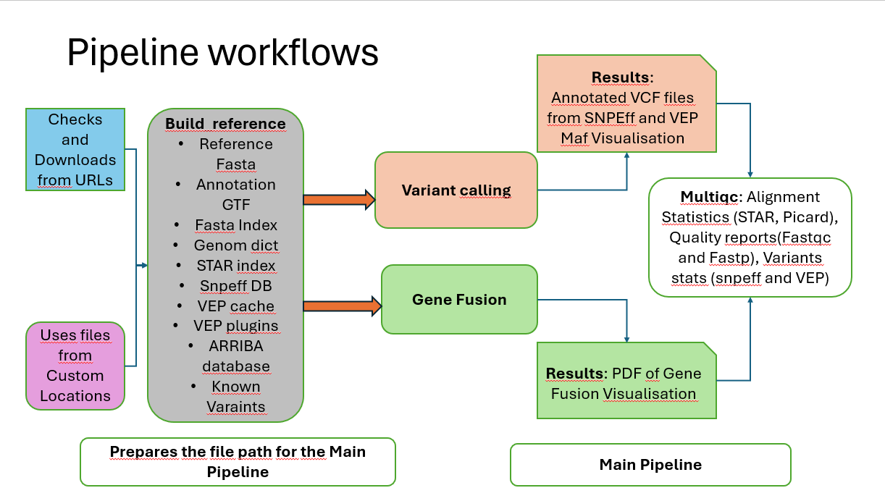

# RNA-Seq Variant Calling & Fusion Detection Pipeline

**A scalable, reproducible, and modular Nextflow pipeline for RNA-seq variant calling and fusion detection.**

**GitHub Repository:** [Variantcalling-and-Genefusion](https://github.com/kothaiRaja/Variantcalling-and-Genefusion.git)

---

## RNA-seq Variant Calling and Gene Fusion Workflow

This flowchart represents the RNA-seq analysis workflow, including variant calling and gene fusion detection.



---

## Overview

This pipeline processes RNA-seq data to:

* **Identify genetic variants (SNPs & Indels)** from transcriptomic data
* **Detect RNA fusion events** critical in cancer research
* **Perform quality control, alignment, annotation, and reporting** in an automated workflow

### Built With

* **Nextflow DSL2** for modular, scalable design
* **Singularity** for containerized, reproducible runs
* Tools: **FastQC**, **Fastp**, **STAR**, **GATK**, **SnpEff**, **VEP**, **Arriba**, **vcf2maf**, **maftools**, **MultiQC**

### Key Features

*  Preprocessing: FastQC, Fastp, MultiQC
*  Variant Calling: STAR, GATK HaplotypeCaller, filtering, annotation with SnpEff & VEP
*  Fusion Detection: Arriba + visualization
*  Reference Setup: Automatic download/indexing of genome, annotation, known variants, and tool resources
*  VCF Post-processing: bgzip, tabix, vcf2maf, maftools
*  Modular Design: Easy extension and reuse of workflows and subworkflows

---

## **Workflow Structure**

### **1. Build Reference (Optional or Precomputed)**

- Checks for user-provided reference files — or downloads if missing  
- Prepares the following:
  - **Reference genome** (FASTA + index + dict)
  - **Gene annotations** (GTF, BED, interval list)
  - **Known variants** (dbSNP, Mills/1000G, blacklist)
  - **Tool resources**: SnpEff DB, VEP cache + plugins, Arriba package
- Outputs a unified config file with resolved reference paths

---

### **2. Preprocessing**

- **FastQC & Fastp**: Raw read quality check and trimming  
- **MultiQC**: Aggregates QC metrics for an overview

---

### **3. STAR Alignment**

- **Two-pass STAR alignment** with splice junctions  
- Filters orphan reads and computes **alignment statistics**

---

### **4. BAM Processing**

- **Sorting**, **marking duplicates**, and **SplitNCigarReads**  
- **Merge BAMs** (if split by intervals)  
- Reset read groups and run **samtools calmd** for MD/NR tags

---

### **5. Base Recalibration**

- **GATK BaseRecalibrator** on known variants  
- **ApplyBQSR** to adjust base quality scores

---

### **6. Variant Calling**

- **GATK HaplotypeCaller** across scattered intervals  
- Merge VCFs and filter for high-confidence SNPs/Indels  
- Compress, index, and generate variant statistics

---

### **7. Variant Annotation**

- **SnpEff** and/or **VEP** (with plugins: LoF, CADD, REVEL, etc.)  
- Convert VCFs to **MAF** using `vcf2maf`  
- Generate mutation summary plots via **maftools**

---

### **8. Fusion Detection (Optional)**

- **Arriba** identifies gene fusions from STAR-aligned BAMs  
- Automatically produces **visual plots** of fusions

---

### **9. Reports**

- **MultiQC** for preprocessing and alignment metrics  
- **Arriba fusion plots** and **MAF visualizations**  
- Software versions and logs for reproducibility

---

## Installation & Setup

### 1. Install Nextflow & Dependencies

```bash
curl -s https://get.nextflow.io | bash
chmod +x nextflow
sudo mv nextflow /usr/local/bin/
```

Make sure **Singularity** or **Docker** is installed.

### 2. Clone the Repository

```bash
git clone https://github.com/kothaiRaja/Variantcalling-and-Genefusion.git
cd Variantcalling-and-Genefusion
```

---
---

##  Configuration Setup (Must Read Before Execution)

Before running the pipeline, **you must create and customize a configuration file** (e.g., `custom.config`) that includes:

-  Paths to **reference files**, or leave them empty to allow auto-download via the `--build_references` flag.
-  Pipeline **execution behavior flags** (e.g., `run_fusion`, `skip_star`, etc.)
-  **Tool configurations**, such as memory, CPUs, annotation options, and plugin support.
-  Directory paths for **input/output**, **logs**, and **tool resources**.

>  **This configuration file is mandatory** and must be passed to the pipeline using the `-c` flag.


## Running the Pipeline

### Step 1: Run with Test Data

```bash
nextflow run main.nf -c nextflow_ref_test.config --build_references_test true -profile singularity
nextflow run main.nf -c nextflow_main_test.config -profile singularity
```

### Step 2: Run with Real Data

```bash
nextflow run main.nf -c nextflow_ref_main.config -c path/to/custom.config --build_references  -profile singularity
nextflow run main.nf -c nextflow_main.config -c path/to/custom.config -profile singularity
```

---

## Input Format: Sample Sheet

Prepare a `samplesheet.csv`:

| sample\_id | fastq\_1                     | fastq\_2                     | strandedness |
| ---------- | ---------------------------- | ---------------------------- | ------------ |
| Sample\_01 | /data/sample\_1\_R1.fastq.gz | /data/sample\_1\_R2.fastq.gz | forward      |
| Sample\_02 | /data/sample\_2\_R1.fastq.gz | /data/sample\_2\_R2.fastq.gz | reverse      |

---

## Output Summary

* `results/multiqc_input/`: FastQC, Fastp, MultiQC outputs
* `results/multiqc_input/`: STAR BAMs, stats
* `results/multiqc_input/: VCFs, GATK logs
* `results/multiqc_input/`: SnpEff, VEP, MAF
* `results/arriba/`: Fusion results + plots
* `results/maftools/`: MAF summary visualizations
* `results/multiqc_quality/: contains html of multiqc report
* `output/: contains all the intermediate files for debugging

---

## Configuration Parameters

Override in `.config` files:

| Parameter       | Description                                                  |
| --------------- | ------------------------------------------------------------ |
| `outdir`        | Output directory                                             |
| `resultsdir`    | Directory for result summaries and final outputs             |
| `samplesheet`   | Path to CSV with sample information                          |
| `run_fusion`    | Run Arriba fusion detection along with variant calling       |
| `only_star`     | Run STAR alignment only (preprocessing and STAR)             |
| `skip_star`     | Skip STAR if pre-aligned BAMs provided                       |
| `concatenate`   | Concatenate FASTQ lanes per sample                           |
| `only_qc`       | Run only QC steps (FastQC, Fastp, MultiQC)                   |


